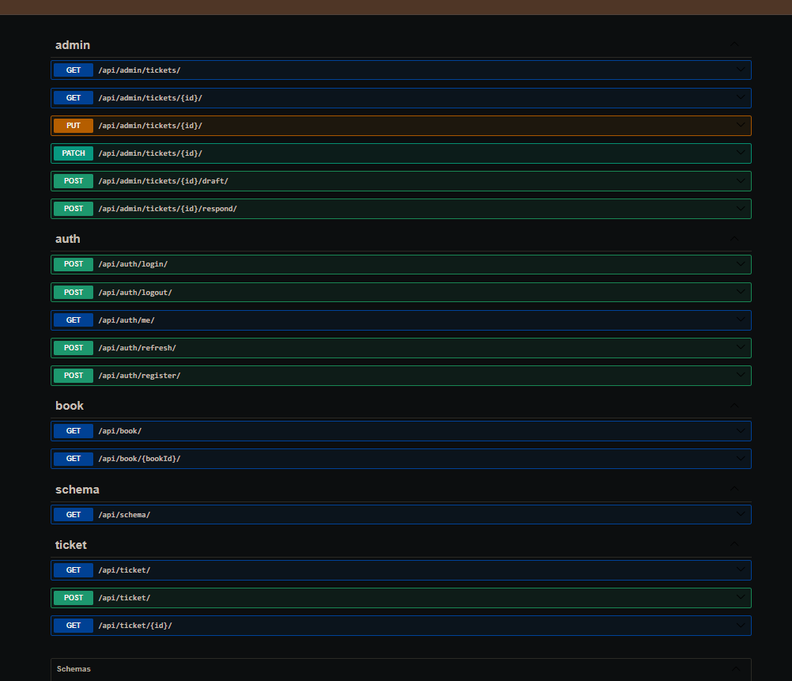

# Backend

## Assumptions 

- Python is installed 
- Python version 3.14 or above

## Set up guide 

```bash
cd Backend
```

- MacOs / Linux
```bash
python3 -m venv .venv 
```
```bash
souce .venv/bin/activate
```

- Windows
```bash
py -m venv .venv
```
```bash
.venv/Scripts/activate
```

Requirements
```bash
pip install -r requirements.txt
```
Boot Backedn
```bash
python manage.py runserveer
```

## Databse setup 

Choose db of any of your choice SQL is prefered . Setup db wiht the .env file by providing the credentials of db 

- DB setup commands
```bash
python manage.py makemigrations
```
```bash
python manage.py migrate
```
```bash
python manage.py seed_data
```

## Environment Variable

The all env variable are avaialble in the .env file you can refere 

**.env.example**

## API Laer 

For the overview of the all APIs you can refer to the swagger document 

at : [Swagger](https://bookleaf-backend-hw7y.onrender.com/api/docs/)



## Disclaimer

**I am short in time due to the medical reason.  So, there might be possible any endpoint not work as expected**