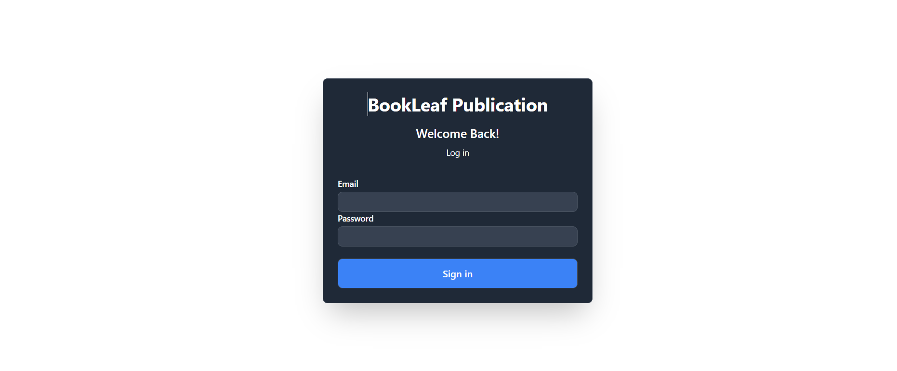
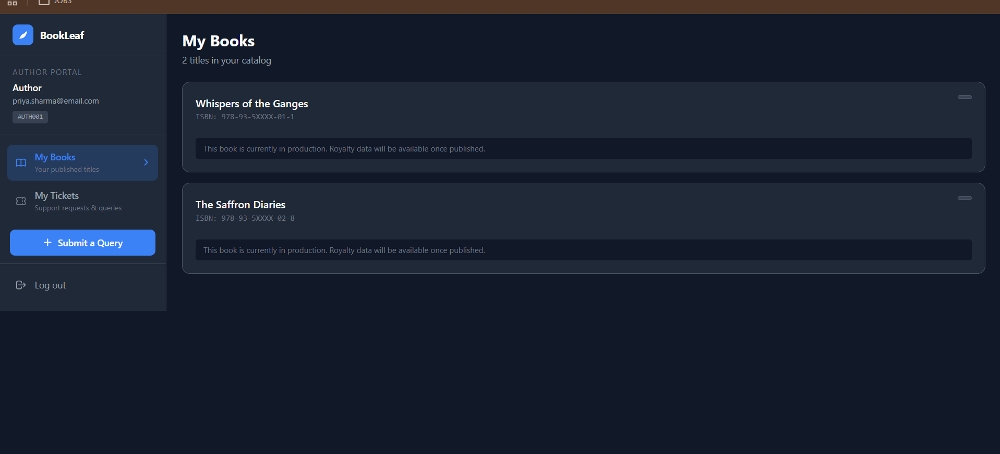
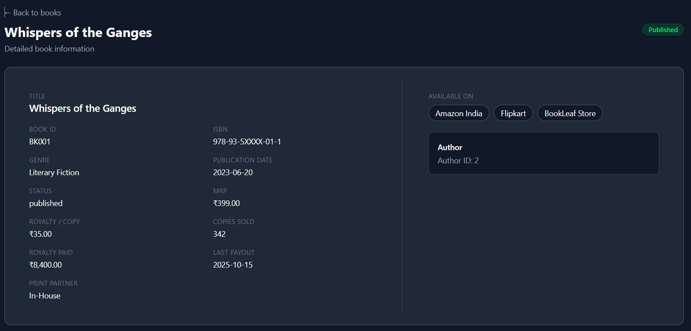
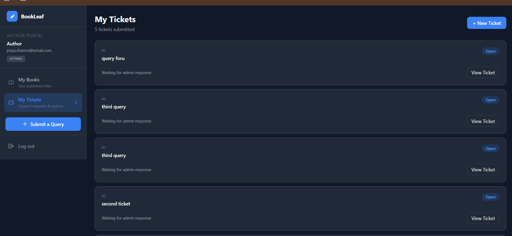
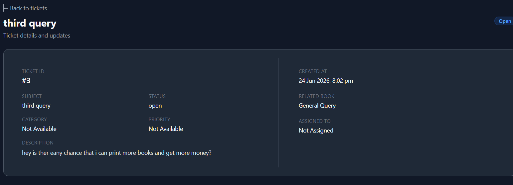
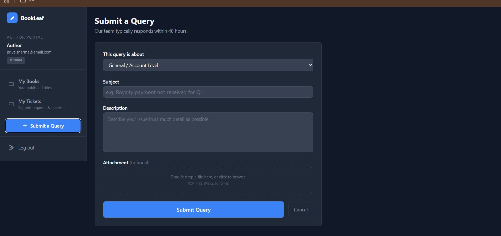
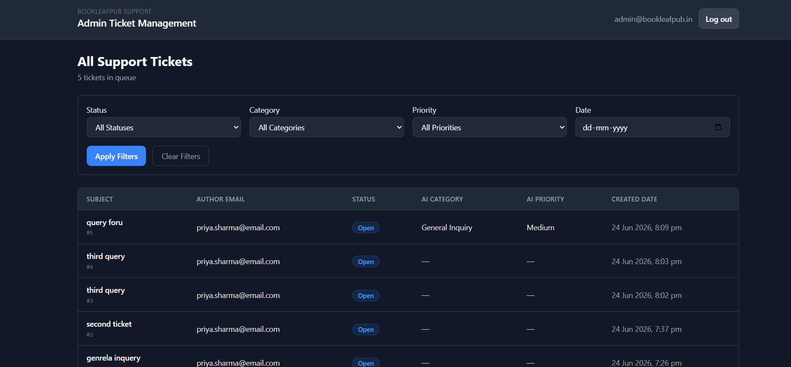
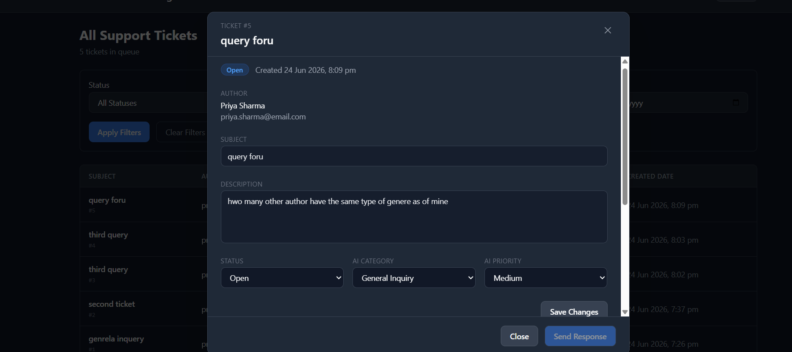

# Frontend

The Frontend is mainly build from the Coding Agents (JLM, Claude, ChatGPT)

## Assumptions:

- Node.js version is 23 and above
- **bun** is installed in system along with Node packages
- Will use bun for the developement and deployment (bun is comparitively faster then other node package managers)

## Installation steps:

```bash
cd Frontend
```
```bash
bun install
```
```bash
bun run dev
```

## Environment Variable

There is only one env varibale and it is for the passing the base url to the frontend to access APIs from backend 
you can refer the file 

**.env.example**

## UI overview

- **Login**


### Author 

- MyBook and Book





- MyTicket and Ticket





- Submit Query



### Admin

- Admin Ticket



- Response Window



## Disclaimer

As the most of the part is build with AI so it has data calling frm the backend with the help of fetch of useEffect but that cna be optimised with thte **Tanstack Query**. I haven't paid any attention on the optimising the wokring and all queries. As it is an assignment. For the nvigating the pages It has been usign the href may be as the sub pages are taking time to get load but if we use the tanstack query this was not the porblem as data got cached at the time of fetch 